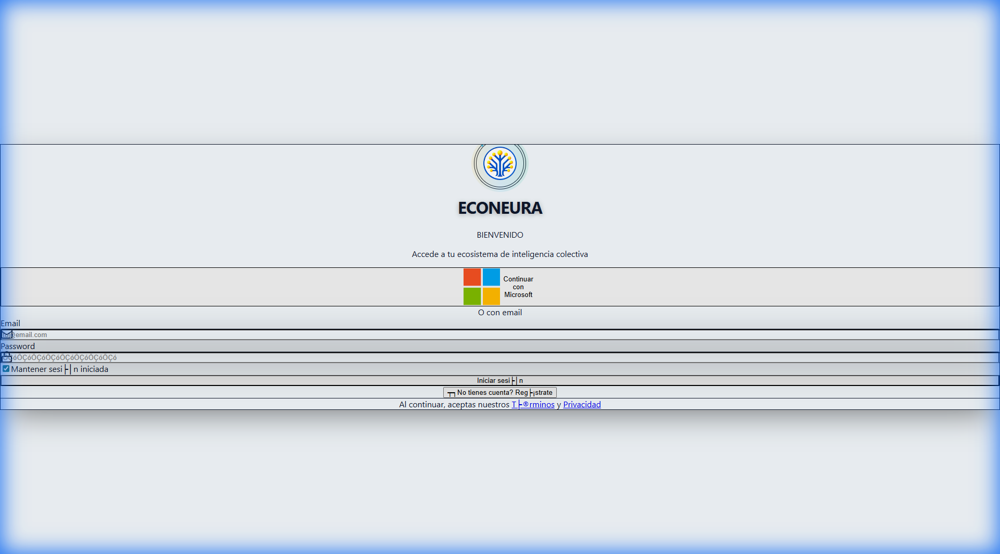

<div align="center">

# 🧠 ECONEURA

### Enterprise AI SaaS Platform with 11 Specialized NEURA Agents

[](https://www.econeura.com)
[](https://github.com/ECONEURA-EMPRESA/ECONEURA-GO/actions)
[](https://econeura-backend-production.azurewebsites.net/api/health)
[](./LICENSE)
[](https://nodejs.org/)
[](https://www.typescriptlang.org/)

**[🌐 Live Demo](https://econeura.com)** • **[📚 Docs](./docs)** • **[🚀 Quick Start](#-quick-start)**



</div>

---

## 📋 Descripción

ECONEURA-FULL es la versión 2025 del SaaS ECONEURA: **multi-tenant**, con **11 NEURAS** (una por departamento) que hablan con humanos vía LLM y orquestan agentes de automatización (Make, n8n, etc.), desplegado en **Azure**.

### ✨ Características Principales

- 🧠 **11 NEURAS** - Asistentes IA especializados por departamento:
    1.  **Neura CEO** - Estrategia y Visión Global
    2.  **Neura CMO** - Marketing y Growth
    3.  **Neura CSO** - Ventas y Revenue (CRM)
    4.  **Neura CTO** - Tecnología y Desarrollo
    5.  **Neura CFO** - Finanzas y Contabilidad
    6.  **Neura COO** - Operaciones y Procesos
    7.  **Neura CPO** - Producto e Innovación
    8.  **Neura CHRO** - Recursos Humanos y Talento
    9.  **Neura CLO** - Legal y Compliance
    10. **Neura CIO** - Información y Datos
    11. **Neura CCO** - Atención al Cliente y Éxito
- 🎯 **CRM Premium** - Panel completo de CRM para Marketing y Ventas con diseño "Premium & Elegant".
- 🏗️ **Arquitectura Enterprise** - DDD + CQRS + Event Sourcing + Hexagonal.
- 🔒 **Seguridad** - RBAC, autenticación Azure AD, audit logs.
- 📊 **Observabilidad** - Application Insights, métricas, logging estructurado.
- 🚀 **CI/CD** - GitHub Actions con workflows optimizados.
- ☁️ **Azure** - Despliegue automatizado con Bicep (IaC).

---

## 🏗️ Arquitectura

```
ECONEURA-FULL/
├── packages/
│   ├── backend/          # API Node.js/TypeScript (Express + Prisma)
│   │   ├── src/
│   │   │   ├── api/      # HTTP routes & Controllers
│   │   │   ├── crm/      # CRM Domain Logic (DDD)
│   │   │   ├── neura/    # NEURA Agents Core Logic
│   │   │   ├── llm/      # LLM Integration (Gemini/OpenAI)
│   │   │   └── infra/    # Infrastructure Adapters (Redis, Blob)
│   │   └── tests/        # Unit & Integration Tests
│   └── frontend/         # React + Vite (SPA)
│       ├── src/
│       │   ├── components/ # UI Components (Premium Design)
│       │   ├── hooks/      # Custom React Hooks
│       │   └── services/   # API Clients
│       └── tests/        # Vitest & Playwright Tests
├── infrastructure/       # Azure Bicep Templates (IaC)
├── scripts/              # PowerShell Automation Scripts
├── docs/                 # Documentation Archive
└── .github/              # GitHub Actions Workflows
```

### Stack Tecnológico

**Backend:**
- Node.js 20+ / TypeScript 5.4
- Express + Zod validation
- PostgreSQL (Prisma ORM) + Redis
- Application Insights
- Google Gemini 1.5 Pro / OpenAI GPT-4o

**Frontend:**
- React 18 + TypeScript
- Vite + Tailwind CSS
- Recharts + Framer Motion
- Playwright (E2E)

**Infrastructure:**
- Azure App Service (Backend)
- Azure Static Web Apps (Frontend)
- Azure Database for PostgreSQL
- Azure Cache for Redis
- Azure Key Vault

---

## ⚡ Quick Start

### Prerrequisitos

- Node.js >= 20.0.0
- Docker Desktop (para entorno local automatizado)
- Cuenta Azure (para deployment)

### Instalación Local (Automatizada)

Hemos creado un script que configura todo el entorno por ti:

```powershell
# 1. Clonar repositorio
git clone https://github.com/ECONEURA-EMPRESA/ECONEURA-GO.git
cd ECONEURA-GO

# 2. Ejecutar Setup Automático (Instala, Levanta Docker, Migra BD, Seed Datos)
./scripts/setup-local.ps1

# 3. Iniciar Desarrollo
npm run dev
```

*   **Frontend**: [https://econeura.com](https://econeura.com) (Production)
*   **Backend**: [https://econeura-backend-production.azurewebsites.net](https://econeura-backend-production.azurewebsites.net)

### Comandos Manuales

```bash
# Build Completo
npm run build

# Tests
npm run test

# Linting
npm run lint
```

---

## 📚 Documentación

### 📖 Guías Principales

- **[Arquitectura](docs/architecture/ARCHITECTURE.md)** - Arquitectura del sistema
### GitHub Actions

El proyecto incluye workflows CI/CD completos en `.github/workflows/`:

- **Backend CI** - Lint, type-check, tests, build.
- **Frontend CI** - Lint, type-check, build, tests.
- **Deploy** - Despliegue automático a Azure (App Service + Static Web App) al hacer push a `main` o `develop`.

### Secretos Requeridos

Para que el despliegue funcione, configura estos secretos en GitHub:

*   `AZURE_CREDENTIALS`
*   `GEMINI_API_KEY`
*   `AZURE_WEBAPP_PUBLISH_PROFILE_BACKEND`
*   `AZURE_STATIC_WEB_APPS_API_TOKEN`
*   `REDIS_HOST`, `REDIS_PASSWORD`

---

## 🧪 Testing

```bash
# Tests unitarios (Backend + Frontend)
npm run test

# Tests E2E (Playwright)
npm run test:e2e
```

---

## 🔒 Seguridad

- ✅ **Autenticación**: Azure AD / JWT
- ✅ **RBAC**: Control de acceso basado en roles (Admin, User, Manager)
- ✅ **Sanitización**: Zod para validación de entradas
- ✅ **Rate Limiting**: Protección contra DDoS y abuso
- ✅ **Secret Scanning**: Cero secretos en código (validado)

---

## 👥 Equipo

**ECONEURA Development Team** - *Innovando con IA Enterprise*

---

<div align="center">

**Hecho con ❤️ por el equipo ECONEURA**

[⭐ Star en GitHub](https://github.com/ECONEURA-EMPRESA/ECONEURA-GO) • [📧 Contacto](mailto:info@econeura.com)

</div>
